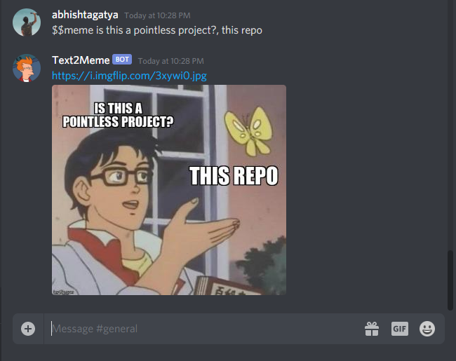

# Text2Meme 🖼️ 
Text2Meme is a Meme Classification Experiment based on Caption Text (Implemented as a Discord Bot)



## About This

I made a meme classification model based on the memes caption text. I implemented this into a discord bot to let people openly use it and expand the training sets. Currently, the model is not learning automattically. That'll be for future works.

## Dataset

[ImgFlip-Scraped Memes Caption Dataset](https://www.kaggle.com/abhishtagatya/imgflipscraped-memes-caption-dataset)

You can freely use the dataset provided in Kaggle. It might not be regularly maintaned, but I also provide a script in `dataset/` that scrapes ImgFlip for more data.

## Try It Out!

[](https://top.gg/bot/691313752037130312)

You can try the bot in your discord server. Although it might not have a 100% uptime.

### Running Discord

Linux :
You can run the bot yourself. Simply clone this repository, then enter the following command:
```sh
$ cd text2meme
$ chmod +x deploy.sh
$ ./deploy.sh
```

Windows or Mac :
You also can run the script in Windows or Mac. Simpy just build and start the Dockerfile.

## Author

- Abhishta Gatya
  Feel free to contribute anything, this project is open.


